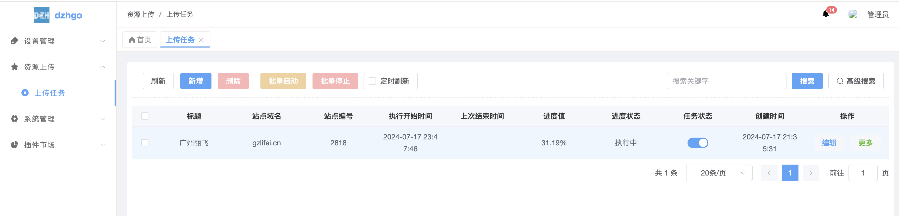
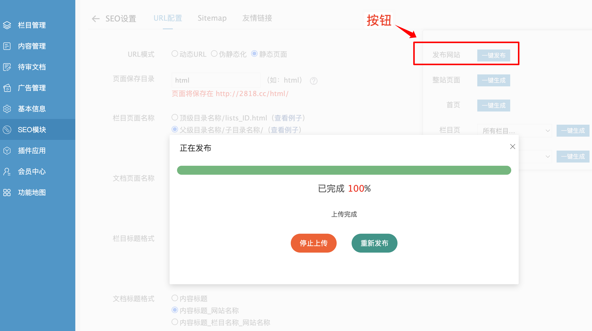

# fileUpload

## 扫码加好友拉群


## dzhgo后台界面


## 主程序dzhgo
* 后台项目地址：https://github.com/gzdzh-cn/dzhgo
* 前端项目地址：https://github.com/gzdzh-cn/dzhgo-admin-vue

### dzhgo后台使用插件界面



## 插件说明
* 插件包，要配合dzhgo主程序使用
* 插件包放到主程序目录addons下
* 在addons/main.go的NewInit方法里 添加 fileUpload.NewInit() ，引入插件
* 启动主程序后，执行fileUpload.NewInit()方法会自动导入插件fileUpload的数据表到数据库

## addons/main.go示例：
```shell
package addons

import (
	"dzhgo/addons/fileUpload"
)

func NewInit() {
	
	fileUpload.NewInit()

}
```

## 插件实现的功能
* 网站后台一键上传静态资源到虚拟主机
* 后台添加上传任务，每个任务通过ftp上传到绑定指定的服务器


# eyoucms后台使用插件说明
* 复制文件到eyoucms后台 application/admin/template/seo/seo.htm 替换，在1302行修改为当前网站编号 
* go后台添加站点 编号要对应刚刚填写的网站编号，并且填写上传参数 
* 后台seo栏目进入，找到右上角，先点击整站生成，再点击发布网站按钮，等待上传完成

**特别注意**
> 后台添加的上传参数的localRootPath的路径必须要是go程序所在的服务器


## 注意事项
> 进度接口返回是流数据，前端需要用fetch来调用，用jq的ajax不支持
> 服务器启动go程序，默认端口是8210，后端go默认开启跨域
> 如果前端和go程序在同一个服务器，直接请求localhost:8209，
> 如果前端外网请求go程序，请配置go代理域名一个域名，前端再请求该域名


###
eyoucms后台上传界面




### 前端参考示例
看根目录的前端示例文件夹


## 资源打包命令

```bash

gf pack addons/fileUpload/resource addons/fileUpload/packed/packed.go -p addons/fileUpload/resource

gf gen dao -p=addons/fileUpload -t=addons_file_upload_config

gf gen service -s=addons/fileUpload/logic -d=addons/fileUpload/service

```


### 修改历史

v1.1.8
- 更新依赖库


v1.1.7
- 修复一些bug，报错录入数据库

v1.1.4
- 更新依赖包
- 后台增加批量启动和停止，可以通过后台一键上传，也可以再调用接口上传
- logic支持model和dao调用，controller路由注册改为model接口

v1.1.3
- 优化一些启动逻辑

v1.1.2
- 迁移到dzhgo后台，作为插件方式
- 后台添加ftp参数，不再由前端发送

v1.1.1
- 优化逻辑，增加并发锁


v1.1.0
- 重构，由原来php的exec调用go改成php调用go接口执行
- 支持多线程同步执行多个网站并发上传


v1.0.2
- 修复ftp上传模式问题，可以自定义设置主动模式和被动模式上传
- 修复一些报错提示问题

v1.0.1
- 指定忽略文件
- 支持上传指定的根目录文件

v1.0.0
- ftp账号，指定目录上传
- 支持指定子目录遍历上传全部文件，保持本地全部目录路径和服务器路径一致

